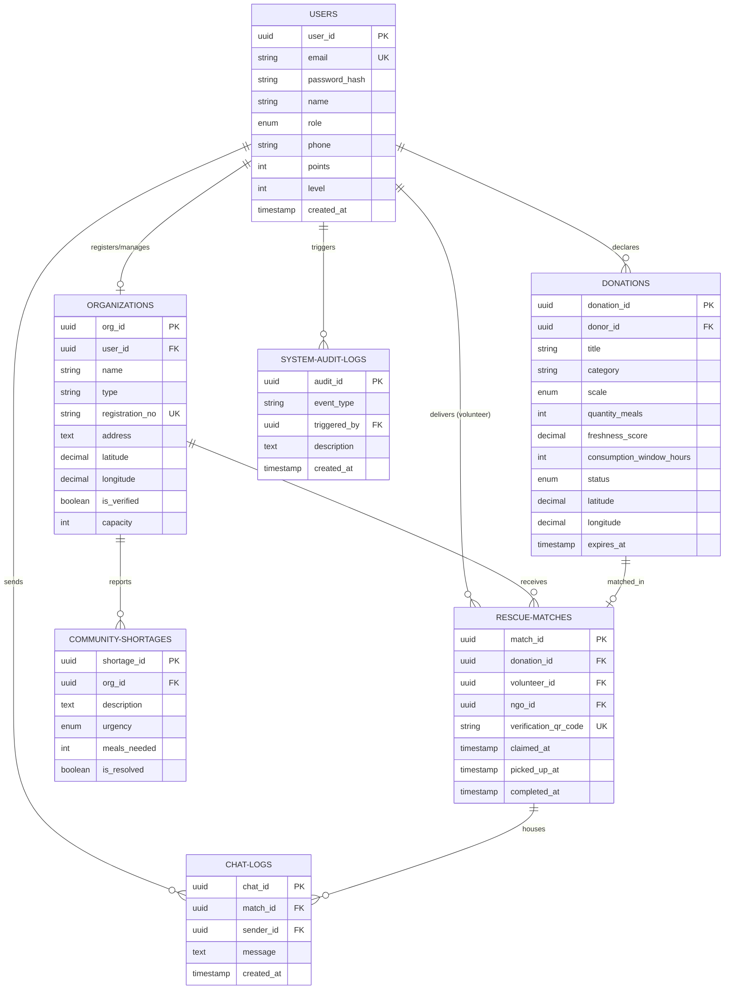

# Entity Relationship (ER) Diagram

Below is the conceptual and logical Entity-Relationship diagram for the **Food Rescue Ecosystem (RescueConnect)** database schema, drafted in Mermaid syntax.

## Schema Structural Rules & Cardinality

1. **USERS to ORGANIZATIONS (`1:0..1`)**: A user can register at most one organization (NGO, Shelter, or Canteen) to bind their role permissions.
2. **USERS to DONATIONS (`1:0..N`)**: A user with the role of `donor` can declare infinite food rescue opportunities.
3. **DONATIONS to RESCUE_MATCHES (`1:0..1`)**: A specific donation is linked to at most one rescue match flow to prevent double-claiming.
4. **RESCUE_MATCHES to VOLUNTEERS (`0..N:1`)**: A volunteer user can claim multiple delivery tasks over their lifetime.
5. **SYSTEM_AUDIT_LOGS (`1:0..N`)**: The security logging engine references back to the causal user (`triggered_by`) for full auditability and trace tracking.
