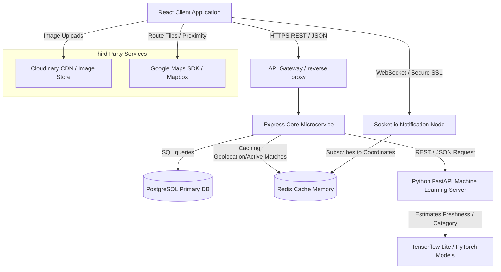

# System Architecture Document

This document outlines the distributed system architecture of **Food Rescue Connect (RescueConnect)**, built to scale from local campus canteens to metropolitan municipal structures.

## System Topology Diagram

The diagram below details the visual data-flow architecture of the ecosystem:

## Architectural Component Descriptions

### 1. Presentation Tier (React Client)
*   **Technologies:** Vite, React, TypeScript, Vanilla CSS.
*   **Purpose:** Delivers a fully responsive, visual interface utilizing dark-glassmorphism. Manages user sessions, accessibility settings (contrast, size scales), and handles multi-role view rendering dynamically.
*   **Caching:** Implements indexed state storage via `localStorage` to assure state continuation across low-signal networks.

### 2. Live Notification Tier (Socket.io Broker)
*   **Purpose:** Houses the active websocket connections for Volunteer riders and shelters.
*   **Behavior:** When a new urgent donation is published, the notification broker reads active volunteer locations cached in Redis, computes proximity indices, and triggers instant alerts to riders within the target perimeter.

### 3. Application Processing Tier (Express / Node.js Engine)
*   **Purpose:** The central logic brain. Handles authentication audits, route match validations, and database updates.
*   **Role Enforcement (RBAC):** Middleware checks verify user roles before exposing secure endpoints (e.g., only Admin role users can read security logs or vetting queues).

### 4. Predictive AI Tier (Python FastAPI Recommender)
*   **Purpose:** Runs the heavy ML computation models away from the main logic node.
*   **Features:**
    *   **Computer Vision Classifier:** Evaluates uploaded food photographs to predict food categories (Grains, Fruits, Bakery, Meat) and volume (servings).
    *   **Freshness Index Estimator:** An XGBoost regressor that calculates safe consumption windows based on item temperature, cooking time, and moisture indexes.
    *   **Route Optimizer:** Solves the vehicle routing problem (VRP) by ranking volunteer paths dynamically according to active road stress and matching coordinates.

### 5. Storage Tier (PostgreSQL + Redis)
*   **PostgreSQL:** Serves as the single source of truth for transaction logs, accounts, gamification achievements, SQL triggers, and security log audit tables.
*   **Redis Memory Store:** Caches dynamic, temporary volunteer telemetry coordinates (lat/long tracks) and claims matching states, assuring sub-millisecond retrieval speeds during peak rush hours.
